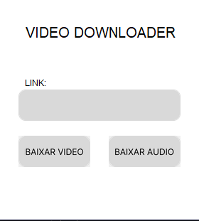

# Video Downloader with Tkinter Designer

This project is an application for downloading videos and audio from YouTube, created using the `tkinter` library for the graphical interface. The interface was generated with Tkinter Designer by Parth Jadhav.


## Features

- Download YouTube videos in the best available quality (prioritizing 720p, 480p, 360p).
- Download YouTube audio.
- Simple and intuitive graphical interface.

## Screenshot



## Requirements
-  Python 3.x
- `pytube` version 15.0.0
## Installation

1. Clone the repository:

```bash
git clone https://github.com/your-username/video-downloader-tkinter.git
cd video-downloader-tkinter
```
2. Install the dependencies:

```bash
pip install pytube
```


## Usage
1. Run the script:

```bash
python ./build/gui.py
```

2. Enter the YouTube video link in the input box.

3. Click the corresponding button to download the video or audio.

## Troubleshooting

- If there is an error during the download, check the terminal output for the message: `Unable to download video/audio due to the following error: {error_message}`.


## Code

The main code of the project is contained in the main.py file. The graphical interface was generated using Tkinter Designer and adjusted as needed. The code performs the video or audio download in a separate thread to ensure the GUI does not freeze during the download process.
## Project 

- `main.py`: Contains the main application code.
- `build/assets/frame0`: Directory where the image assets used in the interface are stored.
## Main Functions

- `start_download_video_thread(link)`: Starts the video download in a separate thread.
- `start_download_audio_thread(link)`: Starts the audio download in a separate thread.
- `download_video(link)`: Downloads the YouTube video.
- `download_audio(link)`: Downloads the YouTube audio.
## Credits

This file was generated by Tkinter Designer by Parth Jadhav:
https://github.com/ParthJadhav/Tkinter-Designer
## License

This project is licensed under the terms of the MIT license. See the `LICENSE` file for more information.

